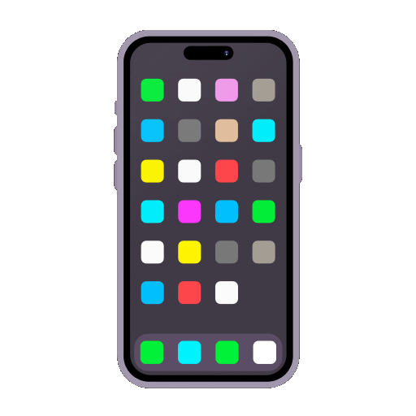
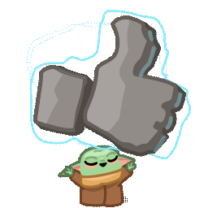
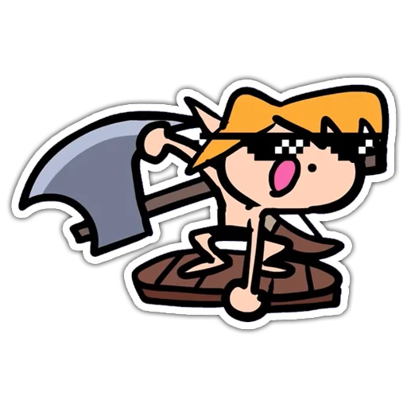
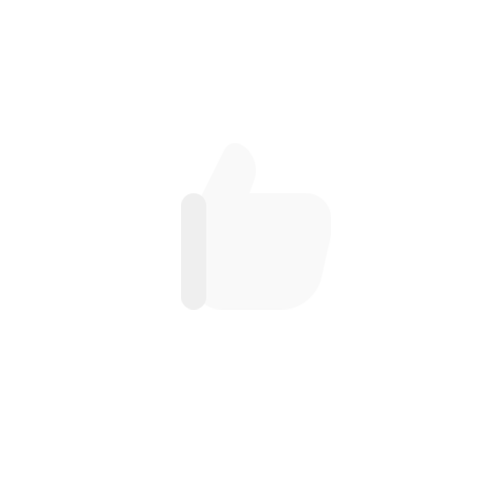

<h1 align="center">Hello fellas , What's up? </h1>

<div align="center">

</div>

## My Social Medias!  

[](https://instagram.com/vncsmnl)
[](https://twitter.com/vncsmnl)
[](https://br.linkedin.com/in/vncsmnl)
[](https://www.reddit.com/user/vncsmnl)
[](https://steamcommunity.com/id/vncsmnl)
[](https://www.twitch.tv/vncsmnl)
[](https://www.hackerrank.com/vncsmnl?hr_r=1)

## Padawan Developer!! 

-  I'm currently studying Systems Analysis and Program Development!...
-  I'm at that stage of discovering everything!...
-  I'm migrating from healthcare (Biomedical Science) to IT...
-  Curious fact: "Vm9jw6ogw6kgYmVtIGludGVsaWdlbnRlIGhlaW4h"

### About me! 

```javascript
const github = {
    pronouns: "He" | "Him",
    code: ["Javascript", "Python","HTML", "CSS","MySQL"],
    askMeAbout: ["WebDev", "Tech", "Gaming"],
    technologies: {
        backEnd: {
            js: ["Node"],
        },
        devOps: ["AWS", "Docker"],
        databases: ["mongo", "MySql", "sqlite"],
        misc: ["Firebase", "Socket.IO", "selenium", "open-cv", "pandas", "SuiteApp","discord.py"]
    },
    currentFocus: "Python",
    fun: "Two bytes meet.  The first byte asks, 'Are you ill?'
          The second byte replies, 'No, just feeling a bit off.'"
};
```
<div align="center" style="display: inline_block"><br>
  <a href="https://www.javascript.com/" target="_blank" rel="noopener noreferrer">
  
  </a>
  <a href="https://www.typescriptlang.org/" target="_blank" rel="noopener noreferrer">
  
  </a>
  <a href="https://pt-br.reactjs.org" target="_blank" rel="noopener noreferrer">
  
  </a>
  <a href="https://www.python.org/" target="_blank" rel="noopener noreferrer">
  
  </a>
  <a href="https://www.djangoproject.com/" target="_blank" rel="noopener noreferrer">
  
  </a>
  <a href="https://www.mongodb.com/" target="_blank" rel="noopener noreferrer">
  
  </a>
  <a href="https://www.docker.com/" target="_blank" rel="noopener noreferrer">
  
  </a>
  <a href="https://code.visualstudio.com/" target="_blank" rel="noopener noreferrer">
  
  </a>
  <a href="https://www.figma.com/" target="_blank" rel="noopener noreferrer">
  
  </a>
</div>

<div align="center">

</div>

<div></div> 
<div></div>
