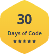

<h1 align="center">Hello fellas , What's up? </h1>

<div align="center">

</div>

---

## My Social Medias!

<a href="https://instagram.com/vncsmnl"></a> <a href="https://twitter.com/vncsmnl"></a> <a href="https://br.linkedin.com/in/vncsmnl"></a> <a href="https://www.reddit.com/user/vncsmnl"></a> <a href="https://steamcommunity.com/id/vncsmnl"></a> <a href="https://www.twitch.tv/vncsmnl"></a>

---

## Padawan Developer!! 

-  I'm currently studying Systems Analysis and Program Development!...
-  I'm at that stage of discovering everything!...
-  I'm migrating from healthcare (Biomedical Science) to IT...
-  Curious fact: QWRvcm8gbWV4ZXIgbm8gY29tcHV0YWRvcg==

---

### About me!

```javascript
const github = {
    pronouns: "He" | "Him",
    code: ["Javascript", "Python","HTML", "CSS","MySQL"],
    askMeAbout: ["WebDev", "Tech", "Gaming"],
    technologies: {
        backEnd: {
            js: ["Node"],
        },
        devOps: ["AWS", "Docker"],
        databases: ["mongo", "MySql", "sqlite"],
        misc: ["Firebase", "Socket.IO", "selenium", "open-cv", "php", "SuiteApp","discord.py"]
    },
    currentFocus: "Python",
    fun: "Two bytes meet.  The first byte asks, 'Are you ill?'
          The second byte replies, 'No, just feeling a bit off. 🤣'"
};
```
<div align="center" style="display: inline_block"><br>
  <a href="https://www.javascript.com/" target="_blank" rel="noopener noreferrer">
  
  </a>
  <a href="https://www.typescriptlang.org/" target="_blank" rel="noopener noreferrer">
  
  </a>
  <a href="https://pt-br.reactjs.org" target="_blank" rel="noopener noreferrer">
  
  </a>
  <a href="https://www.ruby-lang.org/pt/" target="_blank" rel="noopener noreferrer">
  
  </a>
  <a href="https://www.python.org/" target="_blank" rel="noopener noreferrer">
  
  </a>
  <a href="https://www.mysql.com/" target="_blank" rel="noopener noreferrer">
  
  </a>
</div>

<div align="center">

</div>

---

### Badges
<div align="center" style="display: inline_block"><br>
<a href="https://www.hackerrank.com/vncsmnl" target="_blank" rel="noopener noreferrer">

</a>
<a href="https://www.hackerrank.com/vncsmnl" target="_blank" rel="noopener noreferrer">

</a>
<a href="https://www.hackerrank.com/vncsmnl" target="_blank" rel="noopener noreferrer">

</a>
<a href="https://www.hackerrank.com/vncsmnl" target="_blank" rel="noopener noreferrer">

</a>
<a href="https://www.hackerrank.com/vncsmnl" target="_blank" rel="noopener noreferrer">
 <br>
</a>

</div>